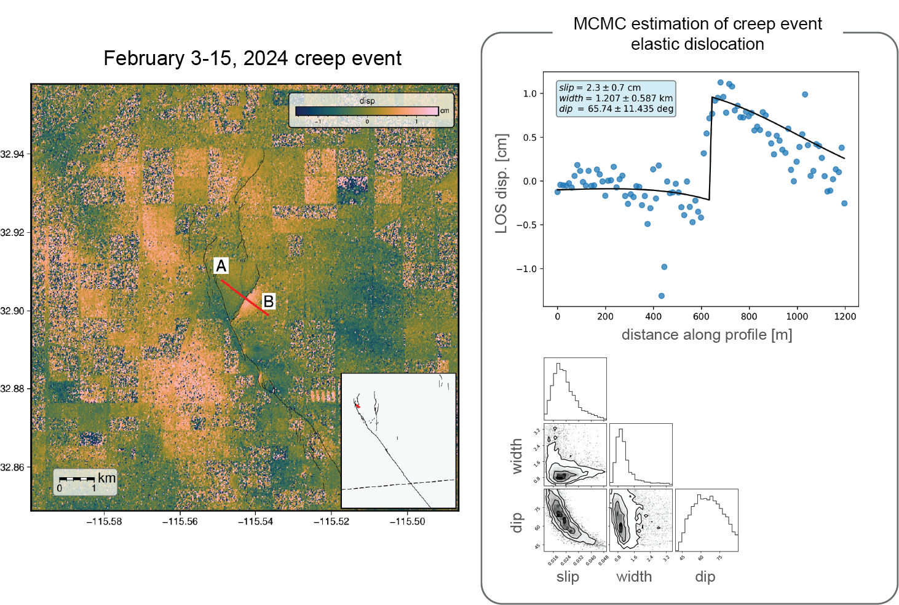

<html lang="en">
  <head>  
    <meta charset="UTF-8" />
    <meta name="viewport" content="width=device-width, initial-scale=1.0" />
    <title></title>
    
  <body>
    <!-- This is the markup of your box, in simpler terms the content structure. -->
    

      Integrated geodetic study of creep events on the Imperial Fault
      <ul class="a">
        <li> Using 10 years of Sentinel-1 InSAR data, with GNSS and creepmeter data, to identify and model creep events on the Imperial Fault, CA. </li>
      </ul>
        

                  
                  
Model results for the February 3-15, 2023 creep event on the W. Mesquite Fault.

        

    

  </body>
